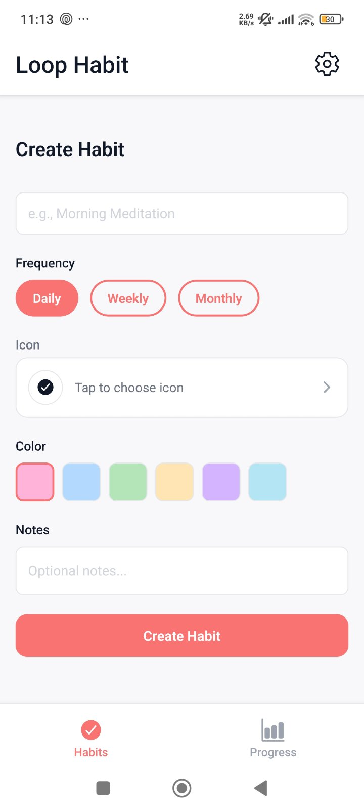
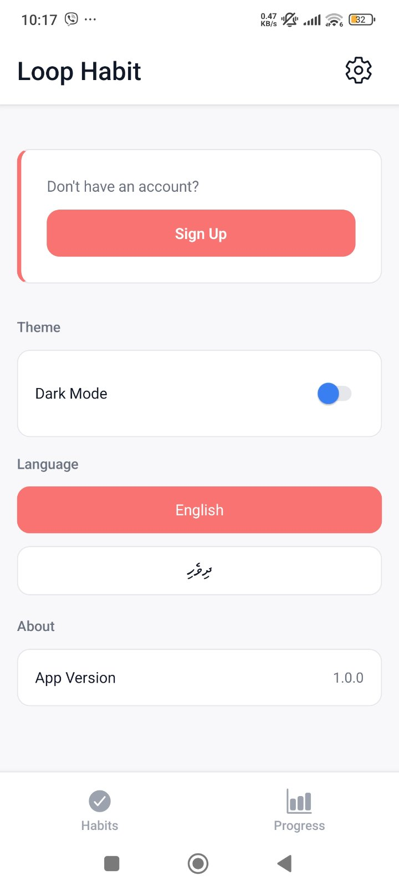
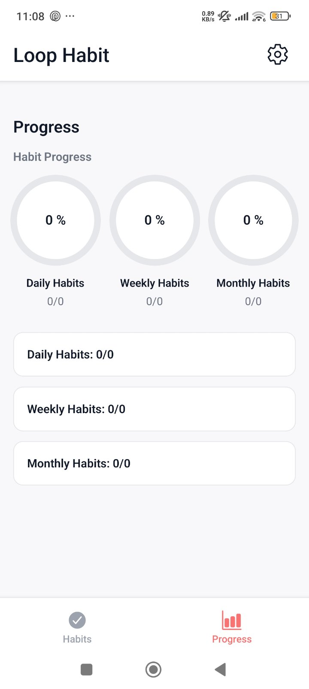
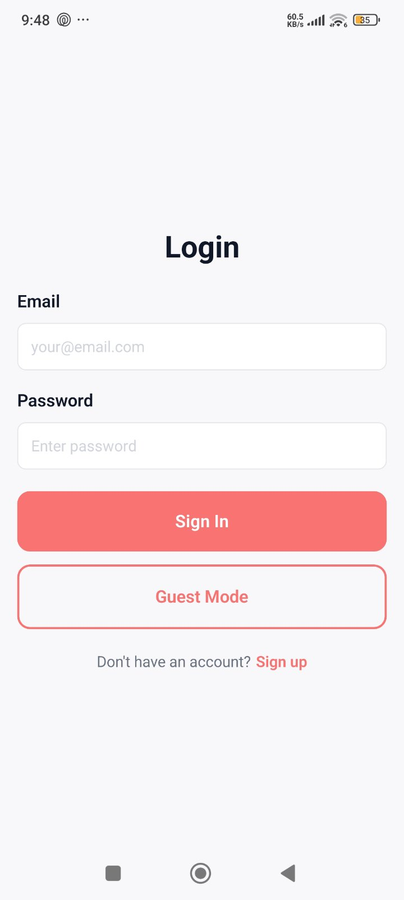
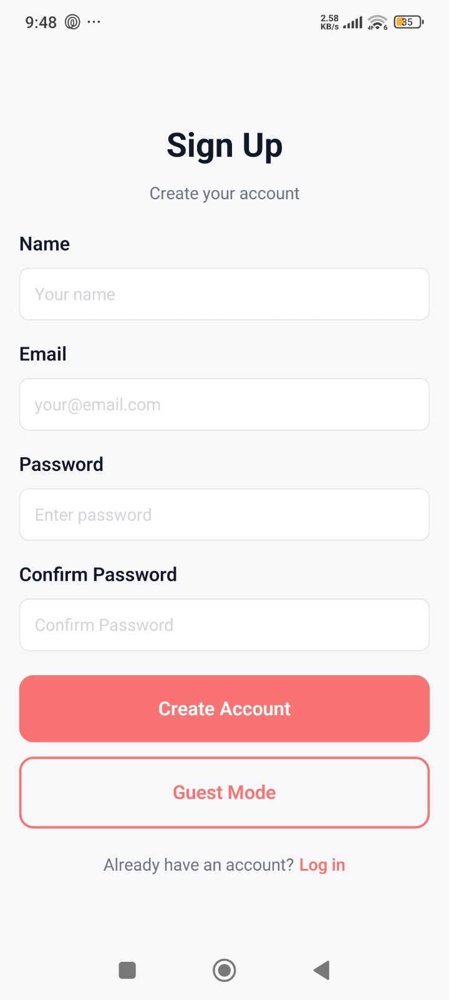
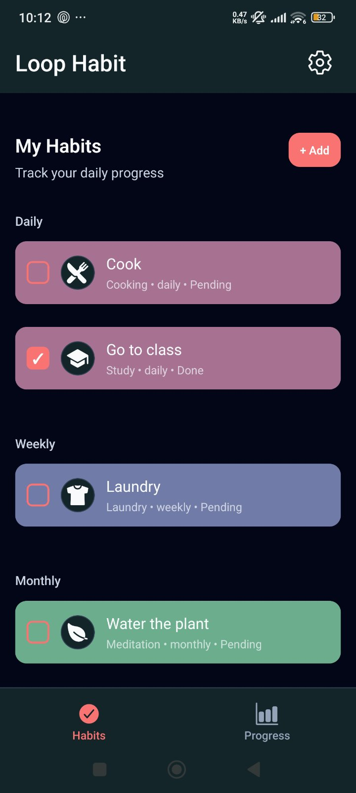
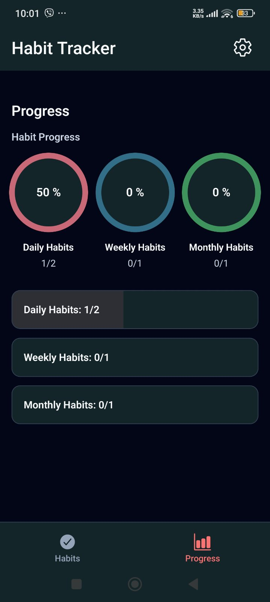
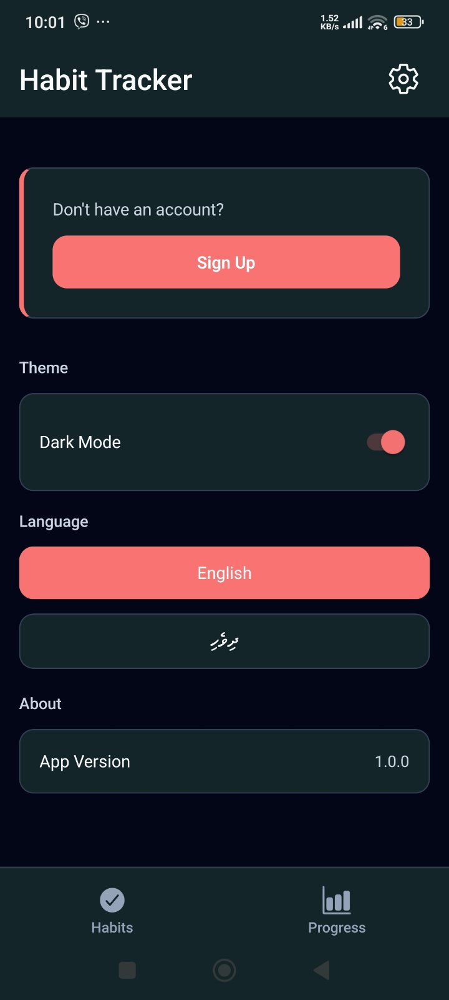

# Loop Habit – Minimal Habit Tracker

Loop Habit is a minimal, pastel-themed habit tracker for iOS and Android built with React Native and Expo. It focuses on clean UX, offline-first behaviour, and simple habit analytics.

**Status:** MVP complete  
**Platforms:** iOS / Android (Expo Go)  

---

## 1. Quick Start

   ### Prerequisites

   - Node.js 18+  
   - npm or yarn  
   - Expo CLI: `npx expo install expo` (or use `npx expo` directly)  
   - Expo Go app on your device **or** Android/iOS emulator

   ### Installation & Run

   ```bash
   fork the repository into your account 
   git clone https://github.com/<your-username>/loop-habit.git
   cd HABIT-TRACKER
   npm install
   npx expo start --tunnel

   Then:
   - Scan the QR code with Expo Go, or

2. Supabase vs Local-only Mode

   Loop Habit works in two modes:

      A) Local-only (Guest Mode)
         - All habits and completions are stored in AsyncStorage only.
         - App works fully offline on a single device.
         - You still get CRUD habits, completion tracking, progress analytics, dark mode, and language toggle.
         - No extra config required.

      B) Supabase sync (optional)
         If you want cloud sync and real authentication:
         - Login using your email and password
         - Auth screens use Supabase Auth.
         - Habits are synced to Supabase for the logged-in user.
         - Local storage still acts as a cache; app is resilient to network issues.

## Features
   1) Habit Management (CRUD)
      Create new habits with:
         - Name
         - Icon (from Loop Habit’s icon picker)
         - Color
         - Frequency: daily, weekly, or monthly
         - Optional notes
      Read habits in a clean list of cards:
         - Icon + color
         - Name
         - Frequency
         - Today’s completion status
      
      Update any habit via an edit screen
      Delete habits with confirmation dialog
      
   2) Completion Tracking
      - Tap the checkbox in a habit card to mark it Done for today
      - Completion stored as date strings (YYYY-MM-DD)
      - State persists after app restart (AsyncStorage)
      - Status text on card shows Done / Pending for today

   3) Progress Analytics
      * Dedicated Progress screen (main feature):
      - Circular progress wheels for daily, weekly, and monthly completion
      - Each wheel shows percentage and counts (X / Y habits)
      - Light and dark mode versions tuned for readability
      - Simple stats overview to see how consistently habits are completed

   3) Settings
      - Dark mode toggle (stored and restored on launch)
      - Language toggle:
      - English (primary)
      - Dhivehi (experimental, machine-assisted; translations may be inaccurate)
      - Optional logout when Supabase is enabled

   4) Offline-first Behaviour
      - All core features work without internet
      - AsyncStorage used for persistence
      - When Supabase is configured, app still functions gracefully if network is unavailable

## Tech Stack
| Layer       | Technology            | Why                                              |
| ----------- | --------------------- | ------------------------------------------------ |
| Core        | React Native + Expo   | Cross-platform, fast development                 |
| Navigation  | Expo Router           | File-based routing, clean stacks and tabs        |
| State       | Zustand               | Minimal global state with persistence middleware |
| Persistence | AsyncStorage          | Local storage for habits, completions, settings  |
| Backend     | Supabase (optional)   | Auth + cloud sync with row-level security        |
| Forms       | React Hook Form + Zod | Type-safe validation and consistent form logic   |
| Styling     | StyleSheet + theme    | Consistent colors, typography, spacing           |
| i18n        | Custom (EN / Dhivehi) | Lightweight, focused on app labels               |
| Language    | TypeScript            | Type safety, better tooling, fewer runtime bugs  |

## Navigation Overview
   Root (_layout.tsx)
   ├─ If not authenticated (Supabase mode):
   │    → (auth)/login, (auth)/signup
   │
   └─ If guest or logged in:
         → (app)/_layout (bottom tabs)
            ├─ Habits tab
            │    ├─ / (habits)/index
            │    ├─ / (habits)/new
            │    └─ / (habits)/[id]
            ├─ Progress tab
            │    └─ /progress
            └─ Settings tab
                  └─ /settings

## Screenshots 

### Light Mode

   

   

### Dark Mode

   
## Testing
   - Manual Testing Checklist
      - Create, edit, and delete habits
      - Mark habits as done; restart app; confirm state is persisted 
      - Confirm progress wheels update when completions change
      - Switch between light and dark mode; restart app; theme persists
      - Switch language; labels update (Dhivehi may be partially translated)
      - Run in both Android and iOS environments
      - Turn off internet:
         - Create/edit/delete habits
         - Mark completions
         - Confirm app still works offline

## Known Issues & Future Improvements
   - Known issues
      - Dhivehi translations are inaccurate / incomplete
      - No push notifications or reminders yet
      - No calendar-style history per habit
      - Cloud sync only available if Supabase keys are configured

   - Future improvements
      - Push notifications for reminders
      - Streaks, badges, and achievements 
      - Calendar and history view for each habit
      - Better Dhivehi translations with human review
      - More advanced analytics (best days, longest streaks, etc.)
      - Multi-device sync and backup by default